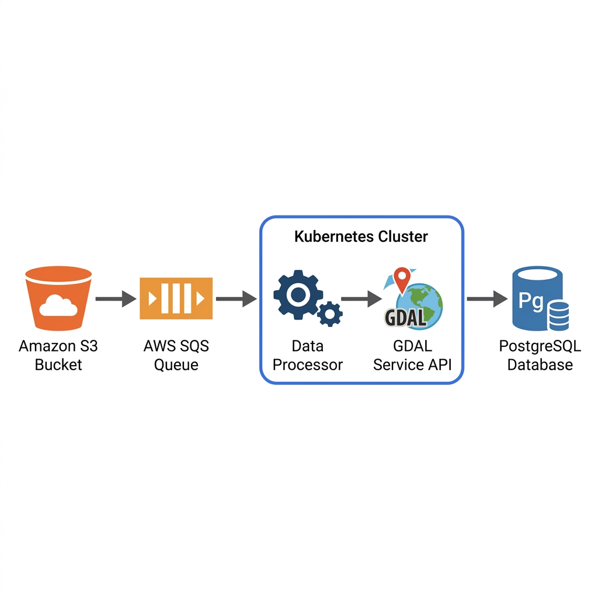

# Asterra DevOps Assignment

## Overview
This project implements a fully automated, cloud-native pipeline for processing geospatial data. The system automatically ingests GeoJSON files uploaded to cloud storage, queues them for sequential processing, validates their geometry using geospatial libraries, and securely stores the extracted metadata in a relational database for further use, such as map rendering.

## Architecture Flow


1. **User** uploads a GeoJSON file to **Amazon S3**.
2. **S3** sends an event notification to an **AWS SQS** queue.
3. **data-processor** (running in Kubernetes) constantly polls the SQS queue and downloads the new file from S3.
4. **data-processor** queries the **gdal-service** to validate and analyze the geospatial data.
5. If valid, the resulting metadata is permanently stored in **RDS PostgreSQL**.

## Technologies
- **Cloud Provider:** AWS
- **Infrastructure as Code:** Terraform
- **Container Orchestration:** Kubernetes (K3s)
- **Deployment & Package Management:** Helm & Helmfile
- **CI/CD:** GitHub Actions
- **Secrets Management:** External Secrets Operator (ESO)
- **Languages & Frameworks:** Python, Flask, GDAL

## Infrastructure
The system provisions a robust AWS environment from scratch:
- **Compute:** A single EC2 instance (Amazon Linux 2023) running a lightweight K3s Kubernetes cluster.
- **Database:** AWS RDS PostgreSQL, accessible only from the Kubernetes cluster.
- **Messaging:** AWS SQS for asynchronous, reliable message processing.
- **Storage:** Amazon S3 for storing incoming GeoJSON files.
- **Registry:** Amazon ECR for securely storing Docker images.
- **Security:** AWS Secrets Manager for database credentials, synced directly to Kubernetes via ESO.

## How to Run

### 1. Bootstrap State Backend
Initialize the S3 bucket and DynamoDB table for Terraform remote state:
```bash
cd terraform/bootstrap
terraform init
terraform apply -auto-approve
```

### 2. Provision Infrastructure
Provision the VPC, EC2, RDS, ECR, SQS, and IAM roles:
```bash
cd terraform
terraform init
terraform apply -auto-approve
```

### 3. Deploy Kubernetes Resources
After the infrastructure is ready, deploy the microservices and operators:
```bash
cd helm
helmfile apply
```

## CI/CD Pipeline
The project utilizes GitHub Actions for continuous integration and deployment, separated into three distinct workflows:

1. **Continuous Integration (`ci.yml`)**: 
   Triggers on all pushes and Pull Requests. It runs Python `pytest` suites inside Docker for the application code and validates Terraform formatting (`terraform fmt` and `terraform validate`), ensuring code quality before any deployment.

2. **Continuous Deployment - App (`cd-app.yml`)**: 
   Triggers on pushes to the `main` branch involving `app/` or `helm/` paths. It builds the Docker images, pushes them to ECR, and runs `helmfile apply` to seamlessly update the application in the Kubernetes cluster.

3. **Continuous Deployment - Infra (`cd-infra.yml`)**: 
   Triggers on pushes to the `main` branch involving `terraform/` paths. It automatically runs `terraform apply` to keep the AWS infrastructure up to date.

## How to Test

1. **Connect to the Cluster (Logs)**
   Export the Kubeconfig generated by Terraform and monitor the `data-processor` logs:
   ```bash
   export KUBECONFIG=~/test/projects/asterra-devops-assignment/.k3s-kubeconfig
   kubectl logs -l app=data-processor-data-processor -f
   ```

2. **Trigger the Flow**
   Upload a sample GeoJSON file to the S3 bucket (replace `<your-bucket-name>` with the actual bucket name created by Terraform):
   ```bash
   cat <<EOF > sample.geojson
   {
     "type": "FeatureCollection",
     "features": [
       {
         "type": "Feature",
         "geometry": { "type": "Point", "coordinates": [34.7818, 32.0853] },
         "properties": { "name": "Tel Aviv" }
       }
     ]
   }
   EOF
   aws s3 cp sample.geojson s3://<your-bucket-name>/
   ```

3. **Verify the Results**
   In your terminal, you will see the `data-processor` receive the SQS message, download the file from S3, validate the spatial data via the `gdal-service`, and insert the final metadata into the RDS PostgreSQL database.
