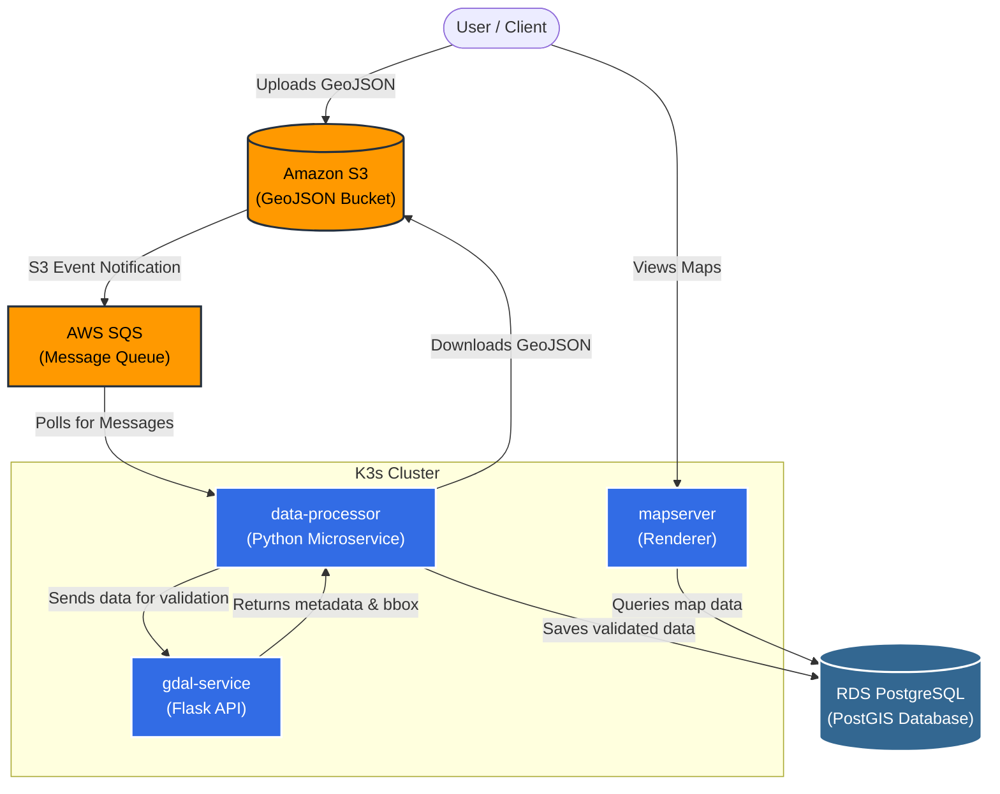
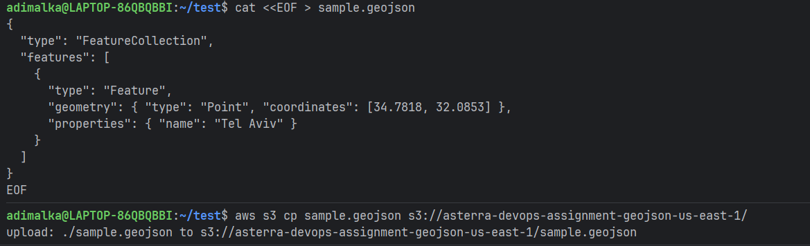
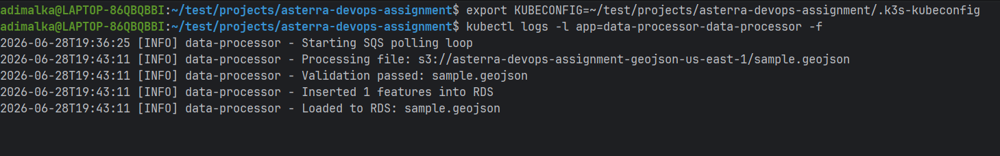

# Asterra Geo-Data Processing Pipeline



## 📖 The Logical Flow (What this project actually does)

This project is an automated, scalable pipeline for processing geospatial data (maps, coordinates, and polygons). 

In the real world, here is how data flows through the system logically:

1. **Data Ingestion:** A new file containing geographical shapes (GeoJSON) is uploaded to our cloud storage (`Amazon S3`).
2. **Event Trigger:** The moment the file is uploaded, a notification is sent to a message queue (`AWS SQS`). This ensures no files are lost and they are processed in a reliable order.
3. **Data Processing (The Brain):** Our `data-processor` microservice (running inside Kubernetes) constantly listens to this queue. When it gets a message, it downloads the map file from S3.
4. **Geospatial Validation:** Before saving anything, the `data-processor` asks the `gdal-service` to inspect the file. The `gdal-service` acts as an expert cartographer—it verifies that the geometry is valid, calculates the bounding box (the area it covers), and counts the features.
5. **Storage & Serving:** If the file is valid, the metadata and results are saved securely into our Relational Database (`RDS PostgreSQL`). From there, tools like `mapserver` can query the database and render visual maps for end-users.

---

## 🛠️ Technical Architecture

To support the logical flow above, we built a fully automated, production-ready cloud environment:

- **Infrastructure as Code (Terraform):** Automatically provisions the entire AWS environment (VPC, EC2, RDS, S3, SQS, ECR, and IAM roles) from scratch.
- **Kubernetes (K3s):** A lightweight Kubernetes cluster runs on the EC2 instance to orchestrate our Docker containers.
- **Microservices:**
  - `data-processor`: A Python worker processing the SQS queue.
  - `gdal-service`: A Python Flask API utilizing OSGeo/GDAL for deep spatial analysis.
  - `mapserver`: An open-source geographic data rendering engine.
- **Secrets Management:** `External-Secrets Operator (ESO)` securely pulls database passwords and credentials from AWS Secrets Manager directly into Kubernetes.

## 🚀 CI/CD Pipelines (GitHub Actions)

We practice strict Continuous Integration and Continuous Deployment using 3 isolated pipelines:

1. **`ci.yml` (Continuous Integration):** Runs on every Push/PR. It executes our Python `pytest` suites inside Docker and validates Terraform formatting without deploying anything.
2. **`cd-app.yml` (App Deployment):** Triggers only on pushes to `main` involving application code. It builds the Docker images, pushes them to AWS ECR, and uses `Helmfile` to seamlessly update the Kubernetes cluster.
3. **`cd-infra.yml` (Infra Deployment):** Triggers only when Terraform code changes. It automatically runs `terraform apply` to keep the AWS infrastructure up to date.

---

## 🧪 Testing the End-to-End Flow

To see the system in action:

1. **Tail the Processor Logs**
   ```bash
   export KUBECONFIG=~/test/projects/asterra-devops-assignment/.k3s-kubeconfig
   kubectl logs -l app=data-processor-data-processor -f
   ```

2. **Upload a Sample GeoJSON**
   ```bash
   cat <<EOF > sample.geojson
   {
     "type": "FeatureCollection",
     "features": [
       {
         "type": "Feature",
         "geometry": { "type": "Point", "coordinates": [34.7818, 32.0853] },
         "properties": { "name": "Tel Aviv" }
       }
     ]
   }
   EOF
   aws s3 cp sample.geojson s3://<your-bucket-name>/
   ```

3. **Check the Output**
   You will instantly see the `data-processor` log the S3 download, the successful GDAL validation, and the database insertion!

### Real Test Results:


